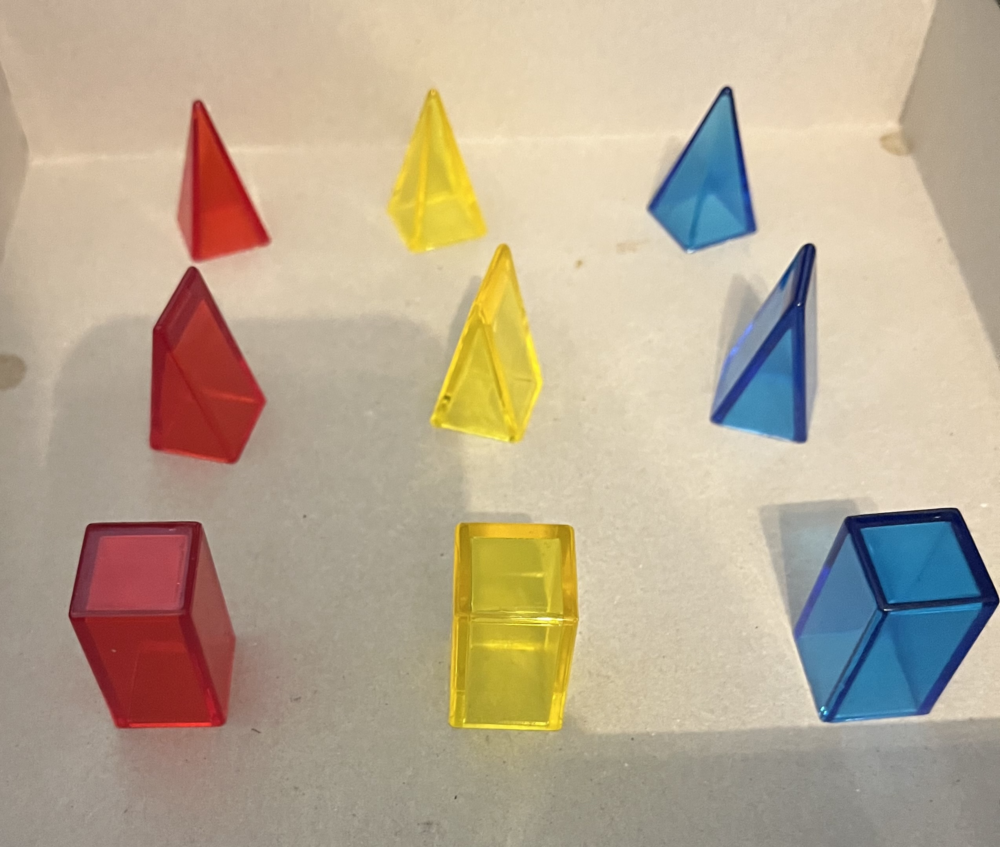
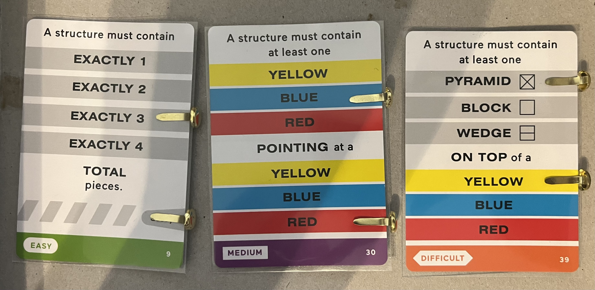
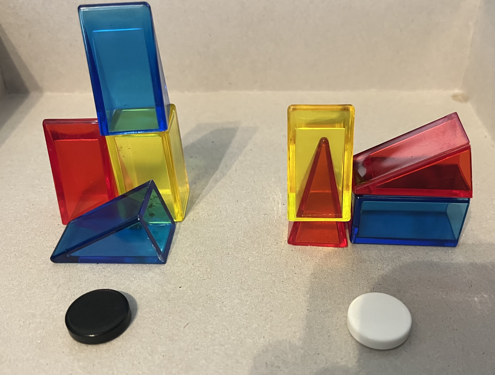
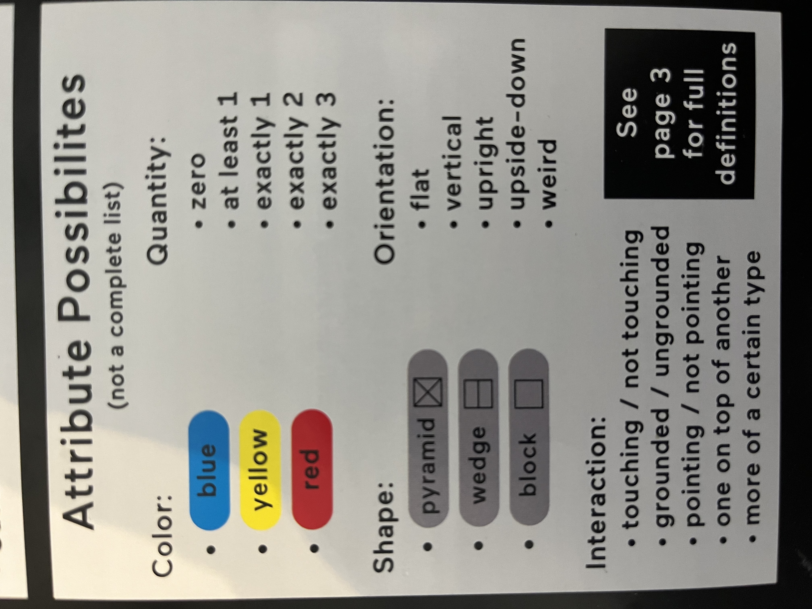

# Zendo Online Co-op Rules

Zendo is an inductive logic game in which the players cooperate to figure out a secret rule. One person will moderate, providing answers to guesses of the secret rule. 

Each game revolves around the idea of a "structure". A structure consists of one or more pieces. 

There are 9 types of pieces: Pyramids, Wedges, and Blocks in the colors Red, Yellow, and Blue. 

Once a structure is created, you could make many true statements about a structure, based on the composition of the structure. 
- "All pieces in this structure are blue"
- "No pieces in this structure are touching"
- "There are more red pieces than wedges"
- "There are exactly 2 upside down pieces"
- "There is at least one block pointed at a wedge" 

All of these statements are what the game considers to be a rule. 

The Moderator begins by selecting a secret rule. The Moderator then creates the first two structures, using one or more pieces for each. One of these structures will follow the secret rule, and the other will not. 

If a structure follows the rule, it will be marked with a white token, and if not, it will be marked with a black token. 

Players will then be allowed to make a guess as to what the secret rule is. 
- If they guess correctly, the rule will be confirmed and the players will win. 
- If the guess is not correct, the moderator will make another structure that proves the guess to be incorrect. This new structure might follow the secret rule, or it might not, and it will be marked with a white or black token as appropriate, but it will always prove the guess incorrect. 

A player can also specifically describe a test structure that they want the Moderator to judge. For example: "A red pyramid and a yellow pyramid, both on top of a sideways blue block". 

Then the moderator will make a structure that follows that description and will judge whether that structure follows the secret rule or not. This is a good way to gain more information about what a rule might be if you don't have a guess you want to make.

Below is a list of most of the possible attributes that can be combined to make a rule.

[Click here for exhaustive definitions of each attribute](https://www.looneylabs.com/sites/default/files/literature/Zendo%20Rules%20Book%202.pdf) on pages 3-6.
